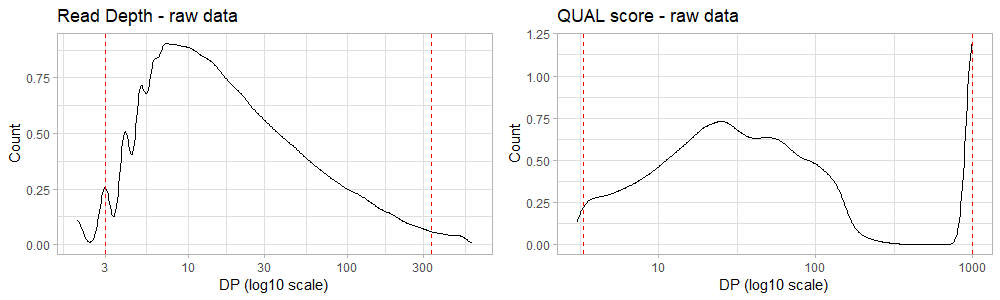
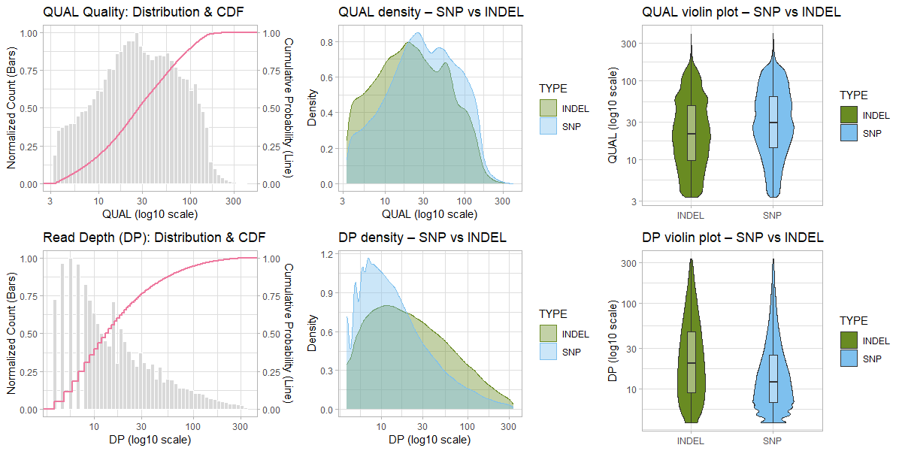
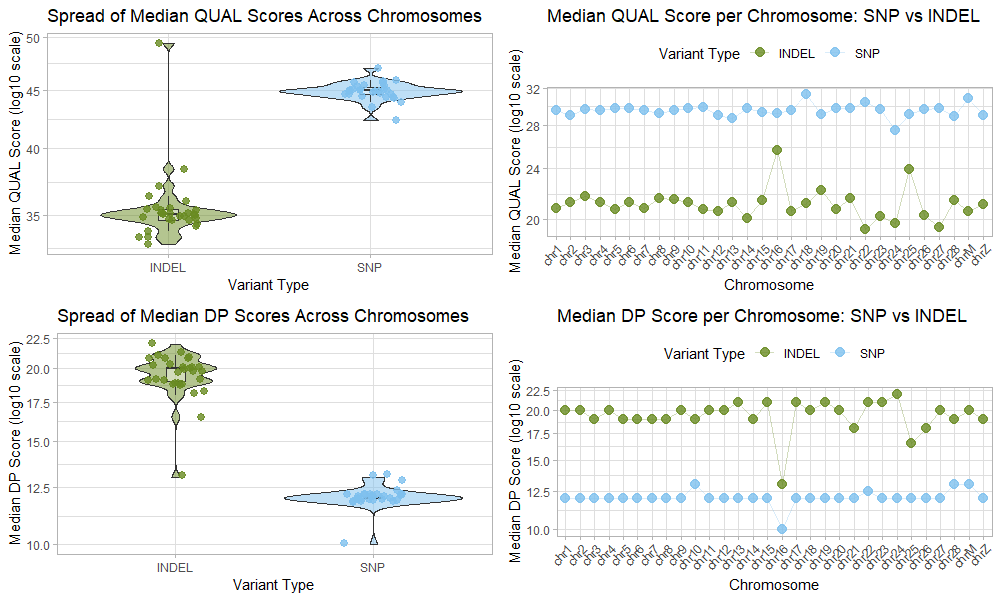
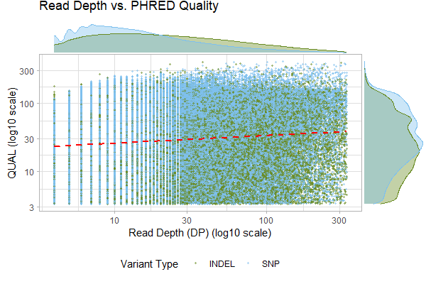
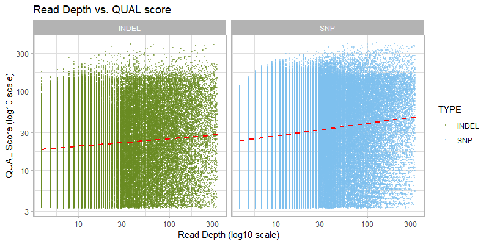

# Unix Course Final Assignment
**Author**: [Zuzana Sevcovicova](https://github.com/Sevcoviz)

## Data preprocessing
- Extracting data from VCF `luscinia_vars_flags.vcf.gz` run `workflow.sh` script 
```bash
./scripts/workflow.sh data/luscinia_vars_flags.vcf.gz data/output/data
```
Output files:
- `data/output/data_part1_core.tsv`: Core VCF fields (CHROM, POS, ID, REF, ALT, QUAL)
- `data/output/data_part2_dp.tsv`: Read depth (DP) values
- `data/output/data_part3_type.tsv`: Variant type (INDEL vs. SNP)
- `data/output/data.tsv`: Combined data for visualization

## Visualization
- Using R graphics session vizualize the data with `data-analysis.R` script

## Preprocessing
Data were filtered based on the following criteria:

**QUAL score filtering**
- data were filtered using the 1st percentile and maximum values of PHRED scores:
  - 1st percentile: 3.3
  - max 900 *(99th percentile is 999 which is not sufficient)*


**Read depth filtering**
- data were filtered using the 1st and 99th percentiles of DP scores:
  - 1st percentile: 3
  - 99th percentile: 337


<figure style="text-align: center;">
  
  <figcaption>
    <em><b>Figure 1:</b> Filters (red) applied to the dataset, left (read depth) and right (PHRED quality) show the distribution of quality metrics  genome-wide</em>
  </figcaption>
</figure> 


<div align="center">

**Table 1:** Summary of Read Depth (DP) before and after filtering

| DP       | Min. | 1st Qu. | Median | Mean     | 3rd Qu. | Max. |
|:---------|-----:|--------:|-------:|---------:|--------:|-----:|
| Raw      | 2    | 8       | 15     | 36.62 | 36      | 607  |
| Filtered | 4    | 7       | 13     | 27.74 | 29      | 336  |

<br>

**Table 2:** Summary of PHRED Quality (QUAL) before and after filtering

| PHRED    | Min. | 1st Qu. | Median | Mean     | 3rd Qu. | Max. |
|:---------|-----:|--------:|-------:|---------:|--------:|-----:|
| Raw      | 3.01 | 14.1    | 32.6   | 158.21 | 84.3    | 999  |
| Filtered | 3.31 | 12.9    | 27.3   | 41.84 | 59.0    | 214  |

</div>

# Results
## TASK 1 + 2 + 3 + 4
>Distribution of PHRED qualities and read depth (DP) over the whole genome, by chromosome and by variant type (INDEL vs. SNP)

<figure style="text-align: center;">
  
  <figcaption>
    <em><b>Figure 1:</b> Distribution of PHRED quality (top row) and read depth (bottom row) scores across whole genome. Left column shows the distributions and cumulative distribution function (pink). Middle (density plots) and right (violin plots) columns show the genome-wide variant type difference (green INDELs, blue SNPs).</em>
  </figcaption>
</figure>

<figure style="text-align: center;">
  
  <figcaption>
    <em><b>Figure 2:</b> Median of PHRED quality (top row) and read depth (bottom row) scores per chromosome. Left panel shows the distribution of median quality scores and the right panel shows individual quality scores for each chromosome.</em>
  </figcaption>
</figure>

###  QUAL (PHRED) score results
- Figure 1. shows that the distribution and CDF is not normally distributed. 
- Figure 1. (top middle and right) shows that the distribution of PHRED scores across variant types is more similar than to the DP scores, with SNPs having slightly higher PHRED scores compared to INDELs.
- Figure 2. (top left) shows that median PHRED scores vary across variant types. Median for SNPs is higher than for INDELs, suggesting that SNPs tend to have higher quality scores compared to INDELs.
- Figure 2. (top right) shows that the distribution of PHRED scores varies across chromosomes, with chromosomes 16 and 25 having higher median PHRED scores than others. The variantion type difference is also observed across chromosomes, with SNPs generally having higher PHRED scores than INDELs on every chromosome.

### DP (read depth) score results
- Figure 1. (left bottom) shows that the distribution of DP log scores is skewed, with a long tail towards higher read depths. The CDF indicates that a large proportion of variants have low read depth, while a smaller proportion have very high read depth.
- Figure 1. (middle and right bottom) shows that the distribution of DP scores varies across variant types, with SNPs having smaller read depth compared to INDELs. 
- Figure 2. (bottom left) shows that median DP scores vary across variant types, with INDELs having higher median DP scores than SNPs, suggesting that INDELs tend to have higher read depth compared to SNPs.
- Figure 2. (bottom right) shows that the distribution of DP scores varied across chrommosomes and variant type. INDELs generally have higher DP scores than SNPs on every chromosome. Chromosome 16 has lower median DP scores for SNPs and INDELs than others. 


## Task 9
>Correlation between PHRED and DP

**Genome wide correlation**
- Weak positive correlation between PHRED and DP
- Spearman's rho ($\rho$) = 0.128 (*p-value* $< 2.2 \times 10^{-16}$). 
- With higher read depth it tends to yield higher PHRED score. 
- However the statistical significance is questionable and likely due to the large sample size ($n = 292 494$), and the correlation is weak.
  
<figure style="text-align: center;">
  
  <figcaption>
    <em><b>Figure 3:</b> Correlation between PHRED quality and read depth (DP) scores genome-wide coloured by variant type (green INDELs and blue SNPs). Red line is the fitted linear model to genome-wide data.</em>
  </figcaption>
</figure>


**Correlation by TYPE (SNP vs INDEL)**
- **SNPs (Spearman = 0.158, Pearson = 0.146)**
- **INDELs (Spearman = 0.083, Pearson = 0.099)**
  - Correlation is stronger for SNPs than for INDELs, suggesting that read depth has a greater influence on PHRED quality scores for SNPs compared to INDELs. But the siginificance of the correlation is questionable due to the large sample size and weak correlation. 

<figure style="text-align: center;">
  
  <figcaption>
    <em><b>Figure 4:</b> Correlation between PHRED quality and read depth (DP) scores separated by variant type. Red line represents fitted linear model to SNPs and INDELs data. </em>
  </figcaption>
</figure>


# Discussion
In this project we analysed data from a *luscinia* genome-wide variant dataset. 

We explored the distribution of PHRED quality and read depth (DP) scores across the genome, by chromosome and by variant type (SNPs vs INDELs). We also investigated the correlation between PHRED quality and read depth.

The results showed that the distribution of PHRED quality and read depth scores is skewed. SNPs tend to have higher PHRED quality scores but lower read depth compared to INDELs. The correlation between PHRED quality and read depth is weak with a stronger correlation observed for SNPs compared to INDELs. The statistical significance of the correlation may be influenced by the large sample size. 


### Authors notes
For this project I used LLMs to help me with the analysis - Claude and Copilot builted in RStudio and VSCode. I used them to elevate my plots and to rewrite my language to be grammatically correct and more concise. 